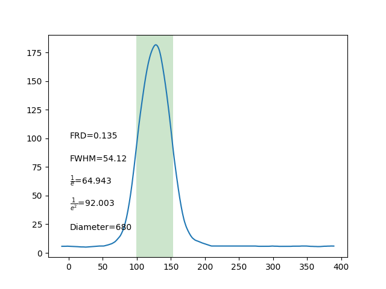

# RAPID
 Ring test Analysis Program for optIcal fiber bunDles (RAPID)
 
 # Motivation
 Ring test analysis is an essential way of checking efficiency and quality of optical fibers but the process can be very time consuming. By RAPID graphical user interface, you can analyze and visualize the output ring images of the fiber by only inputting the output image of the test.
 
 
# An example of the graphical user interface:

# There are 4 variables in the main page of the interface:
* Name = Name of the image file

* Dim1 and Dim2 = The x and y dimensions that cover the diameter of the circle [for the test data in "All" directory, you can use 600 pix and 610 pix to cover the diameter]

* Angle = Rotates the input image with respect to the angle the user enters

* Angle_Num = Rotates the image this many times with respect to the random angles

# There are 7 functions in the main page of the interface:
* Display: Displays the input image as a whole and also a slice of it based on the Dim1 and Dim2 values.

* Slice: Plots Intensity Vs Pixel number graph based in the chosen slice (from Dim1 and Dim2).

* Comparison: Compares the raw data with the smoothed version of it.

* Peak Finer: Finds peaks of the plot generated from Slice functions.

* FWHM, Diameter, FRD Finder: Determines the diameter of the circle (in pixels), fits a spline polynomial to the gaussians and calculates the Full Width Half Maximum (FWHM) and also the Focal Ratio Degradation (FRD) of the ring. 

* Calibrate - FWHM, Radius, FRD Finder: Rotates the image several times with random angles and determines FWHM, Diameter and FRD Finder of the system (this time with standard deviation from several measurments).

# Run the code
   -python RingTest.py

# Output

* Different functions are as following:

"Display":

               

"Slice":

"Comparison":

"Peak Finder":

"FWHM, Radius, FRD Finder":

"Calibrate - FWHM, Radius, FRD Finder":

"Show All":

